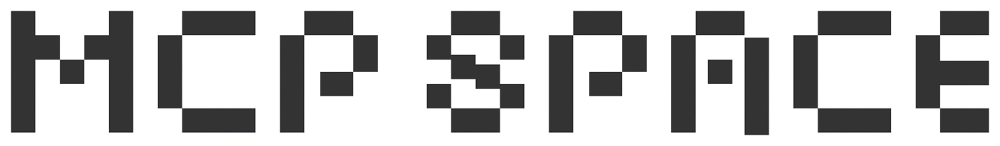
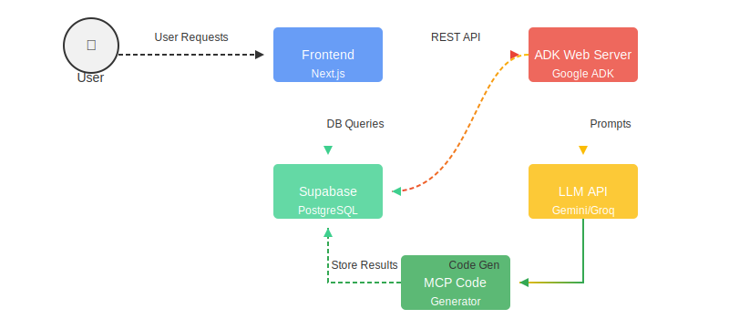

# 🚀 MCP Space Platform

<div align="center">
  
  
  <h2>No-Code AI Tool Builder with Model Context Protocol</h2>
  
  <p>    <a href="https://github.com/tharuneshwar-s/mcp-space" target="_blank"></a>
    <a href="https://mcp.sh/" target="_blank"></a>
    <a href="https://ai.google.dev/docs/agents_api" target="_blank"></a>
    <a href="https://nextjs.org/" target="_blank"></a>
    <a href="https://supabase.com/" target="_blank"></a>
    <a href="https://www.cloudflare.com/" target="_blank"></a>
  </p>
</div>

## 🌟 Overview

<div align="center">
  
</div>

MCP Space is a complete platform for building and deploying AI tools using the Model Context Protocol (MCP). The system enables developers to create powerful AI agents through an intuitive chat interface without writing code, then deploy them with a single click to Cloudflare Workers.

The platform consists of two main components:

1. **Frontend Application**: A Next.js web interface for designing, managing, and deploying MCP servers
2. **Google ADK Backend**: An AI agent system that generates MCP server implementations based on user requirements

## ✨ Key Features

<div align="center">
  <table>
    <tr>
      <td align="center">💬</td>
      <td><strong>AI-Assisted Development</strong>: Create your MCP server by chatting with our Gemini-powered assistant</td>
    </tr>
    <tr>
      <td align="center">🔄</td>
      <td><strong>Orchestrated Workflow</strong>: Step-by-step guidance through the development process</td>
    </tr>
    <tr>
      <td align="center">🛠️</td>
      <td><strong>Visual Tool Management</strong>: Configure, test, and manage MCP tools with an intuitive UI</td>
    </tr>
    <tr>
      <td align="center">📝</td>
      <td><strong>Automatic Code Generation</strong>: Creates TypeScript MCP server implementations</td>
    </tr>
    <tr>
      <td align="center">🔑</td>
      <td><strong>Environment Management</strong>: Securely manage API keys and environment variables</td>
    </tr>
    <tr>
      <td align="center">🚀</td>
      <td><strong>One-Click Deployment</strong>: Deploy your MCP server to Cloudflare Workers instantly</td>
    </tr>
    <tr>
      <td align="center">💾</td>
      <td><strong>Persistent Storage</strong>: All project data stored securely in Supabase</td>
    </tr>
    <tr>
      <td align="center">✨</td>
      <td><strong>Modern UI</strong>: Beautiful space-themed interface with responsive design</td>
    </tr>
  </table>
</div>

## 🏗️ System Architecture

<div align="center">
  
</div>

The MCP Space platform combines multiple technologies to provide a seamless experience:

1. **User Interface Layer**:
   - Next.js 14+ frontend with TypeScript
   - Redux for state management
   - Tailwind CSS with shadcn/ui components
   - Real-time updates and responsive design

2. **AI Agent Layer**:
   - Google Agent Development Kit (ADK)
   - Gemini API for natural language processing
   - Sequential agent orchestration
   - Information collection and code generation

3. **Storage & Authentication Layer**:
   - Supabase PostgreSQL database
   - Google OAuth authentication
   - Secure environment variable management
   - Persistent deployment tracking

4. **Deployment Layer**:
   - Cloudflare Workers for server hosting
   - Automatic build and deployment pipeline
   - MCP protocol compliance testing
   - Deployment status monitoring

## 📁 Project Structure

The MCP Space project is divided into two main directories:

### Frontend Application (`/frontend`)

```
frontend/
├── 📱 src/                    # Next.js application source
│   ├── 🧩 app/                # Next.js App Router pages
│   ├── 🧱 components/         # React components
│   ├── 📚 lib/               # Core functionality
│   └── 🛠️ utils/             # Utility services
├── 🖼️ public/                # Static assets
└── 📊 supabase/              # Database configuration
```

### Google ADK Backend (`/google-adk`)

```
google-adk/
├── 📋 manager/               # Agent management system
│   ├── 🔧 config/            # Configuration utilities
│   ├── 📄 schema/            # Data schemas
│   └── 🤖 sub_agents/        # Specialized AI agents
└── 🖼️ public/                # Static assets and images
```

## 🎬 Demo Video

<div align="center">
  <p>
    <a href="./public/samples/MCP-SPACE Demo - Made with Clipchamp.mp4" target="_blank">
      
      <br />
      <strong>👆 Click to Watch Demo Video</strong>
    </a>
  </p>
</div>

## 🚀 Getting Started

### Prerequisites

- Node.js 18+ (for Frontend)
- Python 3.9+ (for Google ADK)
- Google Cloud account with Gemini API access
- Supabase account

### Running the Frontend

```bash
# Clone the repository
git clone https://github.com/tharuneshwar-s/mcp-space.git
cd mcp-space/frontend

# Install dependencies
npm install

# Set up environment variables
cp .env.local.example .env.local
# Edit .env.local with your API keys

# Start the development server
npm run dev
```

Visit [http://localhost:3000](http://localhost:3000) to access the application.

### Running the Google ADK Backend

```bash
# Navigate to the ADK directory
cd mcp-space/google-adk

# Install dependencies
pip install -r requirements.txt

# Set up environment variables
# Create .env file with required API keys

# Start the ADK web server
adk web --session_db_url="postgresql+psycopg2://{DB_USERNAME}:{DB_PASSWORD}@{DB_HOST}:{DB_PORT}/{DB_NAME}" --allow_origins="*"
```

The ADK server will be available at [http://localhost:8080](http://localhost:8080).

## 🌐 Integration Flow

<div align="center">
  
</div>

The frontend and backend components work together to provide a seamless experience:

1. **User starts in the Frontend**: Authenticates and begins a new MCP server project
2. **Google ADK conversation begins**: User explains their requirements to the AI assistant
3. **Information Collection**: The system gathers specifications for the MCP server
4. **Code Generation**: Complete TypeScript implementation is generated
5. **Configuration**: Environment variables and settings are configured
6. **Deployment**: The server is built and deployed to Cloudflare Workers
7. **Testing & Monitoring**: The deployed server is tested and monitored

## 📚 Documentation

For more detailed information, see the individual README files for each component:

- [Frontend Documentation](./frontend/README.md)
- [Google ADK Documentation](./google-adk/README.md)

## 👥 Contributing

<div align="center">
  
</div>

Contributions are welcome! Please follow these steps:

1. Fork the repository
2. Create a feature branch (`git checkout -b feature/amazing-feature`)
3. Commit your changes (`git commit -m 'Add some amazing feature'`)
4. Push to the branch (`git push origin feature/amazing-feature`)
5. Open a Pull Request

## 📜 License

This project is licensed under the MIT License.

<div align="center">
  <p>
    <b>Made with ❤️ by the MCP Space Team</b>
  </p>
  
</div>
