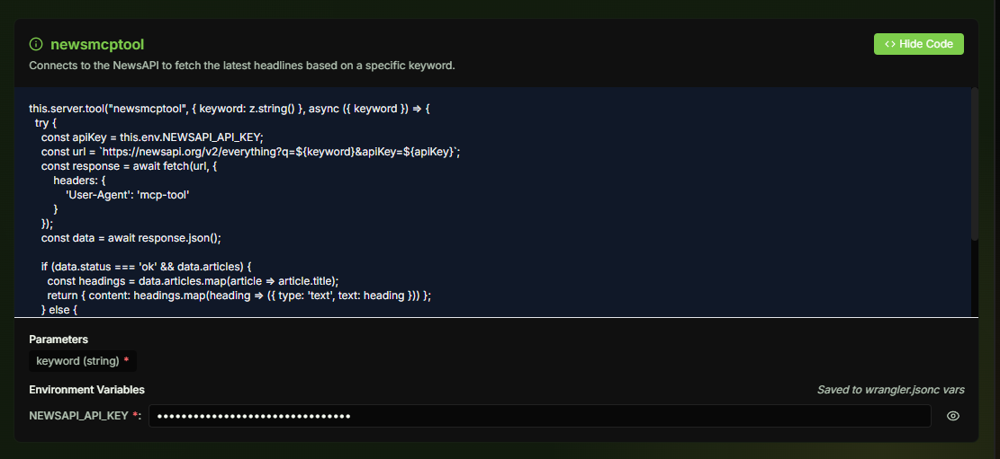

# 🚀 MCP Space Frontend 

<div align="center">
  
  
  <p>
    <a href="https://github.com/tharuneshwar-s/mcp-space" target="_blank"></a>
    <a href="https://nextjs.org/" target="_blank"></a>
    <a href="https://www.typescriptlang.org/" target="_blank"></a>
    <a href="https://tailwindcss.com/" target="_blank"></a>
    <a href="https://redux.js.org/" target="_blank"></a>
    <a href="https://supabase.com/" target="_blank"></a>
    <a href="https://www.postgresql.org/" target="_blank"></a>
    <a href="https://www.cloudflare.com/" target="_blank"></a>
  </p>
  
  <p>
    <a href="../README.md">← Back to Main Project</a> | <a href="../google-adk/README.md">Google ADK Documentation →</a>
  </p>
</div>

## ✨ Overview

<div align="center">
  
</div>

MCP Space is a no-code platform for building and deploying Model Context Protocol (MCP) servers with a chat interface in a single click. The platform enables developers to create powerful AI tools without writing a single line of code.

## 🌟 Features

<div align="center">
  <!-- 
   -->
  <table>
    <tr>
      <td align="center">💬</td>
      <td><strong>Interactive Chat</strong>: Build your MCP server by chatting with our Gemini-powered assistant</td>
    </tr>
    <tr>
      <td align="center">🛠️</td>
      <td><strong>Visual Tool Management</strong>: View and configure your MCP tools with an intuitive UI</td>
    </tr>
    <tr>
      <td align="center">🔑</td>
      <td><strong>Environment Management</strong>: Easily manage API keys and environment variables</td>
    </tr>
    <tr>
      <td align="center">🚀</td>
      <td><strong>One-Click Deployment</strong>: Deploy your MCP server to Cloudflare Workers with a single click</td>
    </tr>
    <tr>
      <td align="center">💾</td>
      <td><strong>Persistent Deployments</strong>: Deployment data is stored in Supabase and persists across page refreshes</td>
    </tr>
    <tr>
      <td align="center">✨</td>
      <td><strong>Modern UI</strong>: Beautiful space-themed interface with responsive design</td>
    </tr>
    <tr>
      <td align="center">⚡</td>
      <td><strong>Real-time Updates</strong>: Instant feedback on server status and tool configurations</td>
    </tr>
    <tr>
      <td align="center">🧰</td>
      <td><strong>Customizable Tools</strong>: Configure tool parameters, descriptions, and logic</td>
    </tr>
  </table>
</div>

## 🛠️ Tech Stack

<div align="center">
  <table>
    <tr>
      <th>Category</th>
      <th>Technology</th>
    </tr>
    <tr>
      <td>Framework</td>
      <td>
        
      </td>
    </tr>
    <tr>
      <td>UI Components</td>
      <td>
         +
        
      </td>
    </tr>
    <tr>
      <td>State Management</td>
      <td>
        
      </td>
    </tr>
    <tr>
      <td>Authentication</td>
      <td>
        
      </td>
    </tr>
    <tr>
      <td>Database</td>
      <td>
        
      </td>
    </tr>
    <tr>
      <td>Deployment</td>
      <td>
        
      </td>
    </tr>
    <tr>
      <td>AI Integration</td>
      <td>
        
      </td>
    </tr>
    <tr>
      <td>Language</td>
      <td>
        
      </td>
    </tr>
  </table>
</div>

## 📸 Sample Screenshots

<div align="center">
  <h3>View more screenshots in the <a href="../README.md#-sample-screenshots">main project README</a></h3>
  
  <h3>User Interface</h3>
  
  
  <h3>Deployment Process</h3>
  <div style="display: flex; justify-content: space-between;">
    
    
  </div>
</div>

## 🎬 Demo

Check out the full demo video in the [main project README](../README.md#-demo-video).

## 🚀 Getting Started
<!-- 
<div align="center">
  
</div> -->

### Prerequisites

- Node.js 18+ 
- npm/yarn/pnpm/bun

### Installation

1️⃣ **Clone the repository**

```bash
git clone https://github.com/tharuneshwar-s/mcp-space.git
cd mcp-space/frontend
```

2️⃣ **Install dependencies**

```bash
npm install
# or
yarn install
# or
pnpm install
# or
bun install
```

3️⃣ **Set up environment variables**

Copy the `.env.local.example` file to `.env.local` and fill in your API keys:

```bash
cp .env.local.example .env.local
```

4️⃣ **Start the development server**

```bash
npm run dev
# or
yarn dev
# or
pnpm dev
# or
bun dev
```

5️⃣ **Open your browser**

Visit [http://localhost:3000](http://localhost:3000) to see the app in action!

<!-- <div align="center">
  
</div> -->

## 📁 Project Structure

<!-- <div align="center">
  
</div> -->

<div>
<!-- <summary>Click to expand project structure</summary> -->

```
frontend/
├── 📱 src/
│   ├── 🧩 app/                    # Next.js App Router pages
│   │   ├── 🔐 (auth)/             # Authentication routes and login flows
│   │   ├── 🛠️ (builder)/          # MCP server builder interface
│   │   ├── 📊 dashboard/          # User dashboard for managing tools
│   │   ├── 🔄 api/                # API route handlers
│   │   └── ⚠️ error/              # Custom error pages
│   │
│   ├── 🧱 components/             # React components
│   │   ├── 💬 ChatPanel/          # Chat interface components
│   │   ├── 🎨 ui/                 # Reusable UI components
│   │   ├── 📄 app-layout.tsx      # Main application layout
│   │   ├── 🧭 navbar.tsx          # Navigation and site header
│   │   └── 🌓 theme-provider.tsx  # Dark/light mode theming
│   │
│   ├── 📚 lib/                    # Core functionality
│   │   ├── 🔄 features/           # Redux slices
│   │   │   ├── 🚀 deployment_state/     # Deployment tracking
│   │   │   └── 🌐 mcp_space_state/      # Global app state
│   │   ├── 🎭 themes/             # CSS theme definitions
│   │   ├── 🔧 utils.ts            # Utility functions
│   │   ├── 🏪 store.ts            # Redux store configuration
│   │   └── 🪝 hooks.ts            # Custom React hooks
│   │
│   └── 🛠️ utils/                  # Utility services
│       ├── 💾 deployments-store.ts  # Persistent store
│       └── 🔌 supabase/           # Supabase configuration
│
├── 📜 scripts/                    # Helper scripts
│   └── 🔄 migrate-deployment-data.ts
│
├── 🖼️ public/                     # Static assets
│   └── 🌌 images/                 # Space-themed UI elements
│
└── 📊 supabase/                   # Supabase configuration
    └── 🗃️ migrations/             # Database schema migrations
```

</div>

<!-- <div align="center">
  
</div> -->

## 🔐 Environment Variables

<!-- <div align="center">
  
</div> -->

Create a `.env.local` file in the root directory with the following variables:

```env
# AI Integration
NEXT_PUBLIC_GEMINI_API_KEY=your_gemini_api_key

# Supabase Configuration
NEXT_PUBLIC_SUPABASE_URL=your_supabase_url
NEXT_PUBLIC_SUPABASE_ANON_KEY=your_supabase_anon_key
```

> 💡 A `.env.local.example` file is provided in the repository as a template. Copy this file to `.env.local` and fill in your own API keys and credentials.

## 🔑 Supabase Google OAuth Setup

<div align="center">
  
</div>

Follow these steps to set up Google OAuth authentication with Supabase:

1. **Create a Google Cloud Project:**
   - Go to [Google Cloud Console](https://console.cloud.google.com/)
   - Create a new project or select an existing one
   - Navigate to "APIs & Services" > "OAuth consent screen"
   - Set up the consent screen (External or Internal)
   - Add necessary scopes (email, profile)
   - Add test users if using External user type

2. **Create OAuth Credentials:**
   - Go to "APIs & Services" > "Credentials"
   - Click "Create Credentials" and select "OAuth client ID"
   - Select "Web application" as the Application type
   - Set a name for your OAuth client
   - Add authorized JavaScript origins:
     ```
     https://your-supabase-project.supabase.co
     http://localhost:3000
     ```
   - Add authorized redirect URIs:
     ```
     https://your-supabase-project.supabase.co/auth/v1/callback
     http://localhost:3000/auth/callback
     ```
   - Click "Create" and note down your Client ID and Client Secret

3. **Configure Supabase Authentication:**
   - Go to your [Supabase Dashboard](https://app.supabase.com/)
   - Select your project
   - Navigate to "Authentication" > "Providers"
   - Find and enable "Google" provider
   - Enter your Google OAuth Client ID and Client Secret
   - Save changes

## 🗄️ Database Schema

<div align="center">
  
  
  <table>
    <tr>
      <th colspan="3">🔧 mcp_server</th>
    </tr>
    <tr>
      <th>Column</th>
      <th>Type</th>
      <th>Description</th>
    </tr>
    <tr>
      <td><code>server_id</code> 🔑</td>
      <td>uuid</td>
      <td>Primary key for the server record</td>
    </tr>
    <tr>
      <td><code>server_name</code></td>
      <td>text</td>
      <td>Name of the MCP server</td>
    </tr>
    <tr>
      <td><code>server_description</code></td>
      <td>text</td>
      <td>Description of the server's purpose</td>
    </tr>
    <tr>
      <td><code>user_id</code></td>
      <td>uuid</td>
      <td>ID of the user who created the server</td>
    </tr>
    <tr>
      <td><code>created_at</code></td>
      <td>timestamptz</td>
      <td>When the server was created</td>
    </tr>
    <tr>
      <td><code>last_update</code></td>
      <td>timestamptz</td>
      <td>When the server was last modified</td>
    </tr>
    <tr>
      <td><code>session_id</code></td>
      <td>uuid</td>
      <td>Session ID for tracking server creation</td>
    </tr>
    <tr>
      <td><code>state</code></td>
      <td>jsonb</td>
      <td>Current state of the server configuration</td>
    </tr>
    <tr>
      <td><code>env_json</code></td>
      <td>jsonb</td>
      <td>Environment variables for the server</td>
    </tr>
  </table>

  <br/>
  
  <table>
    <tr>
      <th colspan="3">🚀 deployment_status</th>
    </tr>
    <tr>
      <th>Column</th>
      <th>Type</th>
      <th>Description</th>
    </tr>
    <tr>
      <td><code>id</code> 🔑</td>
      <td>text</td>
      <td>Primary key for the deployment</td>
    </tr>
    <tr>
      <td><code>status</code></td>
      <td>text</td>
      <td>Current deployment status</td>
    </tr>
    <tr>
      <td><code>url</code></td>
      <td>text</td>
      <td>Deployed server URL</td>
    </tr>
    <tr>
      <td><code>error</code></td>
      <td>text</td>
      <td>Error message if deployment failed</td>
    </tr>
    <tr>
      <td><code>message</code></td>
      <td>text</td>
      <td>Status message for the deployment</td>
    </tr>
    <tr>
      <td><code>tmpdir</code></td>
      <td>text</td>
      <td>Temporary directory used for deployment</td>
    </tr>
    <tr>
      <td><code>createdat</code></td>
      <td>timestamptz</td>
      <td>When the deployment was created</td>
    </tr>
    <tr>
      <td><code>log</code></td>
      <td>text</td>
      <td>Deployment log output</td>
    </tr>
    <tr>
      <td><code>server_id</code></td>
      <td>text</td>
      <td>Reference to the associated server</td>
    </tr>
  </table>
</div>

<!-- <div align="center">
  
</div> -->


## 👥 Contributing

<div align="center">
  
</div>

Contributions are welcome! Please follow these steps:

1. Fork the repository
2. Create a feature branch (`git checkout -b feature/amazing-feature`)
3. Commit your changes (`git commit -m 'Add some amazing feature'`)
4. Push to the branch (`git push origin feature/amazing-feature`)
5. Open a Pull Request

## 📜 License

<!-- This project is licensed under the MIT License. -->

<div align="center">
  <p>
    <b>Made with ❤️ by the MCP Space Team</b>
  </p>
  
</div>
