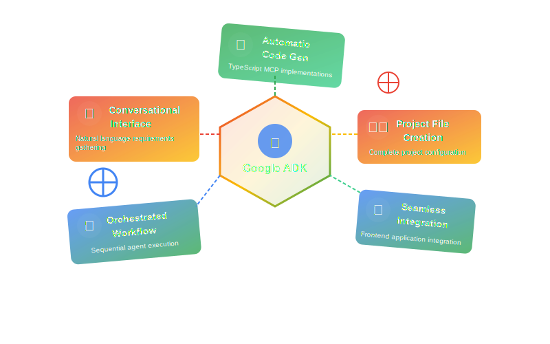
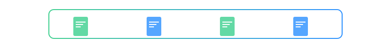
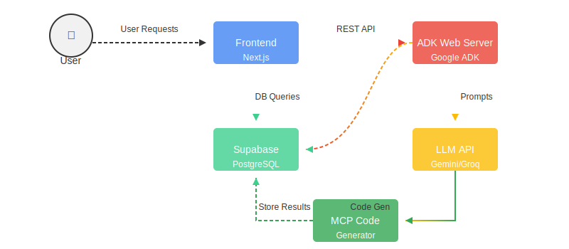

# 🤖 Google ADK MCP Server

<div align="center">
  <!--  -->
  
  
  
  <h3>🌌 Intelligent AI Agent Orchestration 🌌</h3>
  
  <p>
    <a href="https://ai.google.dev/docs/agents_api" target="_blank"></a>
    <a href="https://ai.google.dev/gemini-api/docs" target="_blank"></a>
    <a href="https://python.org/" target="_blank"></a>
    <a href="https://supabase.com/" target="_blank"></a>
  </p>
  
  <!--  -->
</div>

## ✨ Overview

<div align="center">
  
</div>

This project is a Model Context Protocol (MCP) server generator built using Google's Agent Development Kit (ADK). It provides an orchestrated workflow for collecting user requirements and automatically generating TypeScript MCP server implementations.

## 🧠 Key Features

<div align="center">
  
</div>

The Google ADK component of MCP Space enables users to generate MCP servers through conversational interactions. The system uses specialized agents to collect information, generate code, and build project files.

<div align="center">
  <table>
    <tr>
      <td align="center">🤝</td>
      <td><strong>Conversational Interface</strong>: Natural language interactions to gather requirements</td>
    </tr>
    <tr>
      <td align="center">🔄</td>
      <td><strong>Orchestrated Workflow</strong>: Sequential agent execution for consistent results</td>
    </tr>
    <tr>
      <td align="center">📝</td>
      <td><strong>Automatic Code Generation</strong>: Creates TypeScript MCP server implementations</td>
    </tr>
    <tr>
      <td align="center">⚙️</td>
      <td><strong>Project File Creation</strong>: Generates all necessary configuration files</td>
    </tr>
    <tr>
      <td align="center">🔌</td>
      <td><strong>Seamless Integration</strong>: Works directly with the frontend application</td>
    </tr>
  </table>
</div>

## 🔄 Agent Workflow

<div align="center">
  
</div>

The system uses a sequential workflow of specialized agents:


1. **Information Collector Agent** 📋
   - Gathers user requirements through conversation
   - Creates a structured specification for the MCP server
   - Verifies requirements with the user before proceeding

2. **Sequence Code and File Generation Agents** 👨‍💻
   - **Code Generation Agent**: Creates TypeScript code implementations for MCP tools
   - **Tool Builder Agent**: Builds project files (package.json, wrangler.json, index.ts)

## 📁 Project Structure

<div align="center">
  
</div>

<div>


```
google-adk/
├── 📄 app.py                      # Main application entry point
├── 📄 Procfile                    # Deployment configuration
├── 📄 requirements.txt            # Python dependencies
├── 📂 manager/                    # Core management logic
│   ├── 🤖 agent.py                # Main agent orchestration
│   ├── 🔌 sb.py                   # Database connection utilities
│   ├── 🛠️ supabase_tools.py       # Supabase integration
│   ├── 🔧 utils.py                # Helper functions
│   ├── 📂 config/                 # Configuration settings
│   │   ├── 📄 __init__.py
│   │   └── 📄 config.py           # Configuration parameters
│   ├── 📂 schema/                 # Data models and schemas
│   │   ├── 📄 __init__.py
│   │   └── 📄 schema.py           # Pydantic models
│   └── 📂 sub_agents/             # Specialized agent implementations
│       ├── 📄 __init__.py
│       ├── 📂 information_collector_agent/  # Requirements gathering
│       │   ├── 📄 __init__.py
│       │   └── 📄 agent.py
│       └── 📂 sequence_code_gen_agents/     # Code generation
│           ├── 📄 __init__.py
│           └── 📄 agent.py
```


</div>

## ⚙️ Technical Requirements

<div align="center">
  
  
  <table>
    <tr>
      <th>Component</th>
      <th>Requirement</th>
      <th>Description</th>
    </tr>
    <tr>
      <td>🐍 Python</td>
      <td>3.9 or higher</td>
      <td>Core programming language</td>
    </tr>
    <tr>
      <td>🤖 Google ADK</td>
      <td>Latest version</td>
      <td>Agent Development Kit for LLM orchestration</td>
    </tr>
    <tr>
      <td>💾 Database ORM</td>
      <td>SQLAlchemy</td>
      <td>Database abstraction layer</td>
    </tr>    <tr>
      <td>🔧 Configuration</td>
      <td>python-dotenv</td>
      <td>Environment variable management</td>
    </tr>
    <tr>
      <td>🌐 ADK Web Server</td>
      <td>Built-in</td>
      <td>Google ADK's integrated web server</td>
    </tr>
  </table>
</div>

## 🚀 Installation & Setup

<div align="center">
  
</div>

### Prerequisites

- Python 3.9+
- Pip package manager
- Access to Google AI Studio for ADK credentials

### Setup Steps

1️⃣ **Clone the repository**

```powershell
git clone https://github.com/yourusername/mcp-space.git
cd mcp-space/google-adk
```

2️⃣ **Set up a virtual environment**

```powershell
python -m venv venv
.\venv\Scripts\Activate.ps1
```

3️⃣ **Install dependencies**

```powershell
pip install -r requirements.txt
```

4️⃣ **Create .env file**

Create a `.env` file in the root directory with the following variables:

```
# Google AI API configuration
GOOGLE_GENAI_USE_VERTEXAI=FALSE
GOOGLE_API_KEY=your_google_api_key_here

# Groq API configuration (optional)
GROQ_KEY=your_groq_key_here

# Supabase PostgreSQL configuration
SUPABASE_URL=your_supabase_url
SUPABASE_KEY=your_supabase_key

# Database credentials
DB_USERNAME=your_username
DB_PASSWORD=your_password
DB_NAME=your_database_name
DB_PORT=6543
DB_HOST=your_database_host
```

## 🏃‍♂️ Running the Server

<div align="center">
  
</div>

With PostgreSQL session database configuration:

```powershell
adk web --session_db_url="postgresql+psycopg2://{DB_USERNAME}:{DB_PASSWORD}@{DB_HOST}:{DB_PORT}/{DB_NAME}" --allow_origins="*"
```

## 🔌 Integration

<div align="center">
  
</div>

This component integrates with the frontend Next.js application to provide a seamless experience for generating and deploying MCP servers. The communication happens via RESTful API endpoints with JSON payloads.

<div align="center">
  <table>
    <tr>
      <td align="center">🔄</td>
      <td><strong>Real-time Communication</strong>: WebSocket for live updates during generation process</td>
    </tr>
    <tr>
      <td align="center">🔐</td>
      <td><strong>Secure Integration</strong>: API key authentication for all requests</td>
    </tr>
    <tr>
      <td align="center">📦</td>
      <td><strong>JSON Payload</strong>: Structured data exchange in JSON format</td>
    </tr>
  </table>
</div>

## 📊 Architecture Diagram

<div align="center">
  
</div>

<div align="center">
  <p><em>The MCP Space system architecture showing data flow between components</em></p>
</div>

## 📜 License

<!-- This project is licensed under the MIT License. -->

<div align="center">
  <p>
    <b>Made with ❤️ by the MCP Space Team</b>
  </p>
  
</div>
